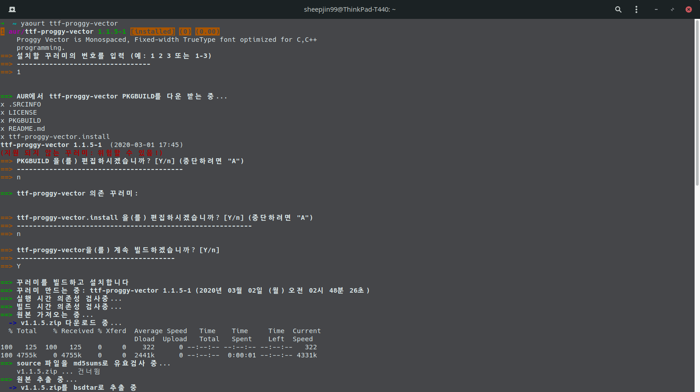
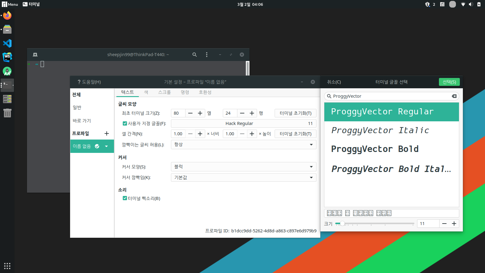

# AUR_ttf-proggy-vector

Proggy Vector is Monospaced, Fixed-width TrueType font optimized for C, C++ programming made by [bluescan](https://github.com/bluescan/proggyfonts).

## Getting Started

This AUR install only 'Proggy Vector Regular' font, original proggy fonts can be installed with another package.

### Prerequisites

Before installing AUR package, you should install AUR helper and dependency packages.

ex) yaourt
```
~ sudo pacman -S binutils gcc pkgfile
~ sudo pkgfile --update
~ sudo pkgfile strip
~ sudo pacman -S pkg-config
~ sudo pacman -S make
~ sudo pacman -S base-devel
~ git clone https://aur.archlinux.org/yaourt.git
~ cd yaourt
~ makepkg -si
```

### Installing

```
~ yaourt ttf-proggy-vector
```


or clone this repository, build and install.

```
~ git clone https://github.com/sheepjin99/AUR_ttf-proggy-vector
~ cd AUR_ttf-proggy-vector
~ makepkg -si
```

##Deployment

Find your font with **ProggyVector**, select and you are done!


## Built With

* [Proggy Fonts](https://github.com/bluescan/proggyfonts) - Thanks to [bluescan](https://github.com/bluescan), who made this awesome font. Proggy Original fonts are really cool too. 
* [pkgbuild-introspection](https://aur.archlinux.org/packages/pkgbuild-introspection/) - Tool for generating .SRCINFO files (mksrcinfo)

## License

This project & base project [Proggy Fonts](https://github.com/bluescan/proggyfonts/blob/master/LICENSE) are licensed under the MIT License - see the [LICENSE.md](LICENSE.md) file for details.

## Acknowledgments

* [YoungbinLab Blog](https://blog.youngbin.xyz/2015-12-13-uploading-package-to-aur/) - Got helped with AUR package upload.
* [ttf-d2coding](https://github.com/nakoo/ttf-d2coding) & [ttf-neodgm](https://github.com/Dalgona/neodgm) - I learned how to create PKGBUILD by these AUR font packages.

